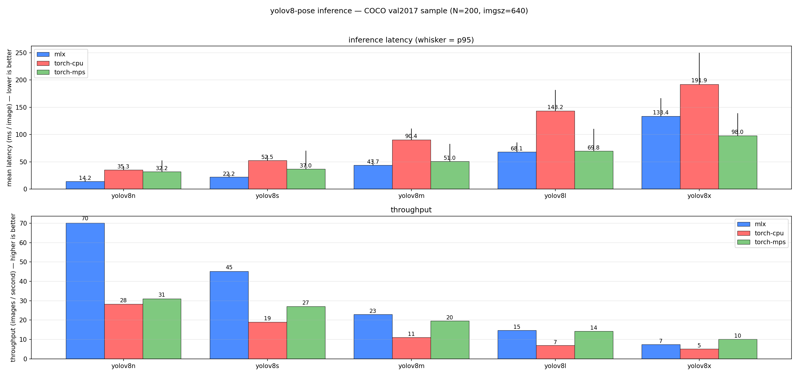

# Cross-backend benchmark

Apples-to-apples per-image latency on the same `yolov8n-pose` weights, same images, same `imgsz`, across:

- **mlx** — `mlxyolos.YOLO`, full pipeline (pre / forward / decode / NMS) on Metal.
- **torch-cpu** — `ultralytics.YOLO(...).to("cpu")`.
- **torch-mps** — same, `.to("mps")`. We call `torch.mps.synchronize()` after every forward so the timer captures the actual MPS work, not just queueing.

Backends absent from the host (no MLX runtime, no MPS device, no torch installed) are auto-skipped.

- [Headline results](#headline-results)
- [How to read the numbers](#how-to-read-the-numbers)
- [Reproducing](#reproducing)
- [Methodology notes](#methodology-notes)

---

## Headline results

`yolov8{n,s,m,l,x}-pose`, 200 random COCO val2017 images per cell, imgsz=640, conf=0.25, iou=0.45, warmup=40.



### Mean latency per backend × scale (ms / image, lower is better)

| Backend     | yolov8n   | yolov8s   | yolov8m   | yolov8l   | yolov8x    |
|-------------|----------:|----------:|----------:|----------:|-----------:|
| **mlx**     | **14.25** | **22.16** | **43.68** | **68.09** | 133.39     |
| torch-cpu   | 35.30     | 52.51     | 90.37     | 143.20    | 191.91     |
| torch-mps   | 32.16     | 36.99     | 50.98     | 69.79     | **98.01**  |

Bold = fastest backend in the column.

### Per-scale detail

| Scale  | Backend     | mean (ms) | median (ms) | p95 (ms) | throughput     | avg obj/img | wall (s) |
|--------|-------------|----------:|------------:|---------:|---------------:|------------:|---------:|
| n      | mlx         | **14.25** | 14.09       | 17.05    | **70.2 img/s** | 1.15        | 2.8      |
| n      | torch-cpu   | 35.30     | 35.26       | 40.99    | 28.3 img/s     | 1.15        | 7.1      |
| n      | torch-mps   | 32.16     | 20.44       | 51.97    | 31.1 img/s     | 1.15        | 6.4      |
| s      | mlx         | **22.16** | 21.77       | 27.34    | **45.1 img/s** | 1.21        | 4.4      |
| s      | torch-cpu   | 52.51     | 52.60       | 61.38    | 19.0 img/s     | 1.21        | 10.5     |
| s      | torch-mps   | 36.99     | 24.23       | 69.84    | 27.0 img/s     | 1.21        | 7.4      |
| m      | mlx         | **43.68** | 43.18       | 54.01    | **22.9 img/s** | 1.23        | 8.7      |
| m      | torch-cpu   | 90.37     | 90.46       | 110.13   | 11.1 img/s     | 1.23        | 18.1     |
| m      | torch-mps   | 50.98     | 37.35       | 82.16    | 19.6 img/s     | 1.23        | 10.2     |
| l      | mlx         | **68.09** | 65.26       | 85.07    | **14.7 img/s** | 1.20        | 13.6     |
| l      | torch-cpu   | 143.20    | 143.94      | 181.21   | 7.0 img/s      | 1.20        | 28.6     |
| l      | torch-mps   | 69.79     | 55.54       | 109.76   | 14.3 img/s     | 1.20        | 14.0     |
| x      | mlx         | 133.39    | 121.45      | 165.99   | 7.5 img/s      | 1.18        | 26.7     |
| x      | torch-cpu   | 191.91    | 191.72      | 249.72   | 5.2 img/s      | 1.18        | 38.4     |
| x      | torch-mps   | **98.01** | 76.19       | 138.62   | **10.2 img/s** | 1.18        | 19.6     |

---

## How to read the numbers

The crossover sits at **yolov8x** — `mlx` wins or ties through `yolov8l`, and only loses to `torch-mps` at the largest scale:

- **Small to large models (n / s / m / l): mlx wins or ties.** mlx is **2.26× faster than torch-mps at yolov8n**, 1.67× at yolov8s, 1.17× at yolov8m, and **essentially tied at yolov8l** (68.1 vs 69.8 ms — a ~2 % margin that's inside the run-to-run variance). The whole pipeline (pre-process, forward, decode, NMS IoU matrix) stays on Metal with lazy graph fusion and a single eval boundary; PyTorch on MPS pays per-op launch overhead and bounces to CPU for the torchvision NMS.
- **Largest model (x): torch-mps pulls ahead.** At yolov8x compute is the dominant cost (~21× more FLOPs than yolov8n) and PyTorch MPS' tuned matmul kernels finally amortize the per-op overhead. torch-mps is **1.36× faster than mlx at yolov8x**.
- **torch-cpu loses everywhere.** Predictably — even for the smallest model the CPU path is ~2.5× slower than mlx, and ~2× slower than torch-mps at yolov8x.
- **`avg obj/img` agrees across all three** at every scale (1.15–1.23). Same NMS shape, no post-processing divergence — the latency comparison is apples-to-apples.

So the practical rule is: **use mlx for n/s/m, use torch-mps for l/x** if you're running yolov8-pose at imgsz=640 today. The crossover point will move depending on imgsz and image complexity, but the underlying physics — overhead-bound on small graphs, compute-bound on big ones — is the same.

The MPS p95↔median ratio stays high across all scales (e.g. 55/21 = 2.6× at yolov8n, 134/75 = 1.8× at yolov8x). That's structural, not warmup-related: `torchvision.ops.nms` falls back to CPU on MPS, and the round-trip cost varies per image with the number of candidate boxes. More warmup won't fix it.

---

## Reproducing

```bash
# Same dataset the COCO mAP eval uses:
bash scripts/get_coco_pose_val.sh

# Download all five Ultralytics .pt files and convert each to MLX (one-time):
bash scripts/download_convert_v8.sh

# All five scales, all three backends, default --n-images 200 --warmup 40:
pip install -e '.[benchmark]'
python scripts/benchmark_inference.py
```

The script writes a vertical grouped-bar chart (latency on Y, scale on X, one bar per backend per scale, p95 whisker on each) to `benchmark.png` next to the run. We commit the chart at [`docs/benchmark.png`](benchmark.png) so the README stays viewable on hosts without the COCO dataset or the `[benchmark]` extras installed — pass `--save-plot docs/benchmark.png` to write directly there.

Common variations:

```bash
# Subset of scales while iterating:
python scripts/benchmark_inference.py --scales n,s

# Only one backend (faster smoke run):
python scripts/benchmark_inference.py --only mlx

# Different sample size or warmup:
python scripts/benchmark_inference.py --n-images 500 --warmup 60

# Weights stored elsewhere:
python scripts/benchmark_inference.py \
    --pt-pattern  '/weights/yolov8{scale}-pose.pt' \
    --mlx-pattern '/weights/yolov8{scale}-pose.safetensors'
```

For sample count: at N=200 with a CV (std-dev / mean) of ~5–10%, the standard error of the mean is already 0.4–0.7%. Going to 1000 cuts that to 0.2–0.3%, but the trend is statistically settled at 200. Save the wall time.

For warmup: 40 covers MPS shader compilation across all five scales. Lower values (e.g. 10) start to undercount MPS' effective speed because the v8-pose graph touches enough distinct ops that the first ~20 calls per scale are still paying compilation cost.

---

## Methodology notes

- **Same `.pt` source on both torch backends.** We load the original Ultralytics `yolov8n-pose.pt` for torch-cpu / torch-mps so the underlying weights are identical to what `mlx-yolos convert` produced for the MLX backend.
- **Per-call sync on MPS.** `torch.mps.synchronize()` is invoked after every forward; without it the timer captures only enqueue time and reports artificially low MPS latency.
- **MPS p95 spread is structural.** `torchvision.ops.nms` falls back to CPU on MPS, and the MPS→CPU→MPS round-trip cost varies per image with the number of candidate boxes. More warmup won't fix it; that's a PyTorch-side engineering issue.
- **Image read + letterbox stay on the host on every backend.** They're CPU-bound regardless and would only confuse the cross-backend comparison.
